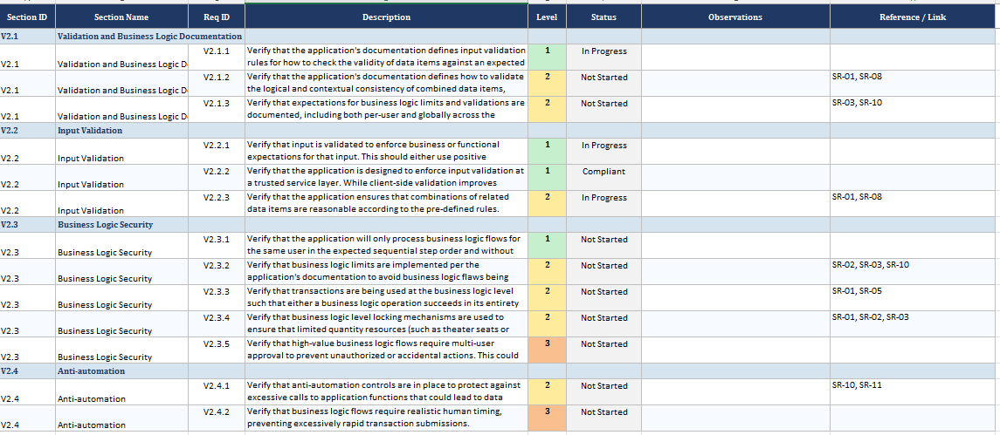

[Voltar ao README](../README.md)

[Próximo ficheiro](security_testing.md)

[Ficheiro anterior](mitigations.md)

---

The OWASP Application Security Verification Standard is an essential file to help a team define its Security
Requirements.

There's 3 levels that can be filled, being 1 the lowest and helps define the requirements for a low-level application, 2
for a standard and 3 for a high-level application

In the following project, the level 1 and 2 will be taken in consideration.

Since they help define the security requirements, it is mandatory that each requirement is linked to a specific SR. At
this phase of the project, Phase 1, it's only necessary to complete the ASVS to ensure that the application BioCantinas
meets the necessary for each Req ID (Not Started, In Progress, Compliant, Not Applicable)

The following image is an example of ASVS completeness (ASVS -v5.0.0 V2):

Link to [ASVS tracker](ASVS_5.0_Tracker.xlsx) 

---

[Voltar ao README](../README.md)

[Próximo ficheiro](security_testing.md)

[Ficheiro anterior](mitigations.md)