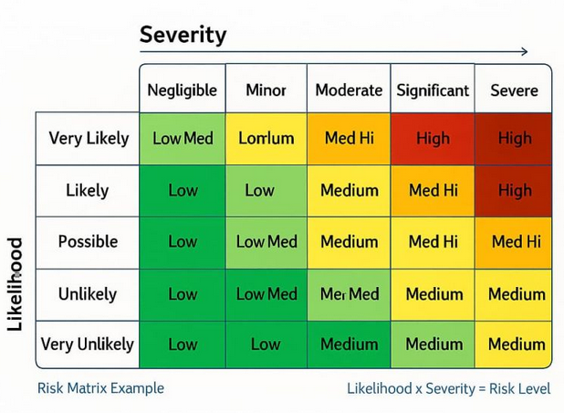

## Risk assessment (ISO 31000:2018)

### Methodology

For this section, "**ISO 31000:2018** - *Risk management - Guidelines*" was adopted as the reference for identification, analysis, evaluation, and treatment of risks.

Reference: [ISO 31000:2018](https://studylib.net/doc/26126608/iso-31000?p=13).

The **5×5 matrix** illustrated above is used to combine **Impact** and **Likelihood** and determine the **risk level** for each scenario, consistent with the usual style of representation in risk assessment under ISO 31000.

### Analysis criteria (scale 1–5)

| Scale   | Impact          | Likelihood       |
|---------|-----------------|------------------|
| 1       | Negligible      | Rare             |
| 2       | Minor           | Unlikely         |
| 3       | Moderate        | Possible         |
| 4       | Severe          | Likely           |
| 5       | Very severe     | Very likely      |

For each risk, **Impact** and **Likelihood** (1–5) are assigned, with a textual rationale. The numeric value used in the matrix is:

**`Risk score = Impact × Likelihood`** (between 1 and 25).

### 5×5 combination matrix (example aligned with ISO 31000)

The values in parentheses correspond to **Impact × Likelihood**. The risk level is read from the corresponding cell.

| Impact \\ Likelihood   | **1 - Rare**   | **2 - Unlikely**   | **3 - Possible**     | **4 - Likely**     | **5 - Very likely** |
|------------------------|----------------|----------------------|----------------------|----------------------|------------------------|
| **5 – Very severe**    | Medium **(5)** | Medium High **(10)** | High **(15)**        | Very High **(20)**   | Very High **(25)**     |
| **4 – Severe**          | Low **(4)**    | Medium **(8)**       | Medium High **(12)** | High **(16)**        | Very High **(20)**     |
| **3 – Moderate**       | Low **(3)**    | Medium **(6)**       | Medium **(9)**       | Medium High **(12)** | High **(15)**          |
| **2 – Minor**        | Low **(2)**    | Low **(4)**          | Medium **(6)**       | Medium **(8)**       | Medium High **(10)**   |
| **1 – Negligible** | Low **(1)**    | Low **(2)**          | Low **(3)**          | Low **(4)**          | Medium **(5)**         |

---

## Risk identification and rationale

*(What was observed in the *backend* and why it is a risk to security and business objectives.)*

**R1 - Insufficient access control**  
The REST API does not, for most routes, enforce who may invoke each operation. The authentication middleware [authMiddleware.ts](../../Backend/src/middlewares/authMiddleware.ts), which validates the JWT and attaches `id` and `role` to the request, is not applied to the active routes; it is only functional for performing login. Thus, most *endpoints* allow reads and writes without a valid session.
Any client able to reach the server can perform domain-sensitive actions. 

**Justification:** impact on **confidentiality** (reading others’ data), **integrity** (improper changes to state and business rules) and, in abuse scenarios, **availability** of the service.

**R2 - Inconsistent or weak JWT secrets**  
In [UserController.ts](../../Backend/src/Controller/UserController.ts), login signs the JWT with `SECRET_KEY`; in [authMiddleware.ts](../../Backend/src/middlewares/authMiddleware.ts), verification uses `JWT_SECRET`. The same secret should be defined in a single configuration place, because signing and validating the *token* are the two halves of the same operation (issue the signature and verify it). **Two distinct environment variables** force two values to be kept in sync and encourage configuration mistakes. Moreover, if `.env` is missing, login falls back to a **weak, fixed** string in code (`"minha_chave_secreta"`), which is **bad for security** (predictable secret). 

**Justification:** risk to **authentication** and **confidentiality** (inconsistent sessions or forgeable *tokens*).

**R3 - Information disclosure in error messages**  
For example, in [UserController.ts](../../Backend/src/Controller/UserController.ts) (`register`), the `catch` returns `res.status(500).json({ message: "Erro ao criar utilizador.", error: err })`, including the error object in the client response. Other controllers return 500 responses with `error.message` or `message: error.message`, which may expose exception details. 

**Justification:** technical information in the response *payload* helps an attacker map failures and refine attacks - **operational security** risk (increases the likelihood of follow-on abuse).

**R4 - Files exposed on the `/uploads` route**  
In [index.ts](../../Backend/index.ts), `app.use("/uploads", express.static(...))` maps the **`/uploads`** URL to the on-disk file folder. `express.static` makes those files reachable by URL without going through the API’s authorization logic.

**Justification:** submitted documents (e.g. PDFs) may be retrieved by anyone who discovers or knows the path - risk to **confidentiality** of supplier or applicant data.

**R5 - No rate limiting on login and limited session handling**  
`POST /users/login` imposes neither attempt limits nor cooldown, exposing the service to brute force and request abuse. The JWT is issued with `expiresIn: "1d"` in [UserController.ts](../../Backend/src/Controller/UserController.ts). For example, for 24 hours a stolen token remains valid, with no revocation mechanism evident in the code. 

**Justification:** risk to **confidentiality** and **availability** of accounts.

**R6 - PDF upload with limited validation**  
On upload in [ApplicationRoutes.ts](../../Backend/src/Routes/ApplicationRoutes.ts), the *multer* filter accepts files with `Content-Type` `application/pdf`. **MIME** is a label sent by the client in the HTTP request; it does not prove the actual file content and can be misleading. Thus, the server may store data that is not the expected PDF or that is harmful.

**Justification:** MIME-only validation is insufficient to guarantee the real file content, affecting **integrity** of data and stored files and, in abuse scenarios, **availability** of the service.

**R7 - Confidentiality in transit (HTTP without TLS)**  
The API is served over HTTP (`express`); login requests carry credentials and, after authentication, the JWT travels in headers. **Without HTTPS/TLS**, traffic is sent in cleartext on the network. 

**Justification:** on untrusted networks or exposed *hosting*, traffic may be intercepted (*sniffing*) - serious **confidentiality** impact. Complements R1/R2: the transport layer may expose secrets.

**R8 - JSON body without an explicit limit**  
In [index.ts](../../Backend/index.ts), `express.json()` is registered without a `limit` option. 

**Justification:** very large JSON bodies can consume excessive memory and degrade the process - **availability** risk (*DoS* via payload).

**R9 - Debug logging with request data**  
For example, in [MenuController.ts](../../Backend/src/Controller/MenuController.ts) the full `req.body` is written to `console.log` when creating a menu. 

**Justification:** beyond the information disclosure referred to in **R3** (HTTP response to the client), the issue here is the **destination of logs**: business data from the request may appear in *logs* accessible to third parties — **confidentiality** risk on that surface.

## Risk evaluation (table)

The score is **Impact × Likelihood**. The level (Low / Medium / …) is read from the **5×5 matrix** above for the (Impact, Likelihood) pair.

| ID | Description (summary)                                                  | I | L | Score    | Level (matrix) | Priority |
|----|------------------------------------------------------------------------|---|---|----------|----------------|----------|
| R1 | Missing authentication/authorization on critical operations            | 5 | 5 | **25**   | Very High      | 1        |
| R2 | JWT secret inconsistency and weak *fallback*                           | 4 | 3 | **12**   |  Medium High   | 3        |
| R3 | Information disclosure in HTTP 500 errors                              | 2 | 3 | **6**    | Medium         | 8        |
| R4 | Exposure of `/uploads` via static files                                | 3 | 3 | **9**    | Medium         | 5        |
| R5 | No *rate limiting* on login; long JWT (1d) without explicit revocation | 3 | 3 | **9**    | Medium         | 4        |
| R6 | PDF *upload* with validation essentially by MIME                       | 3 | 3 | **9**    | Medium         | 6        |
| R7 | HTTP without TLS: credentials and JWT in readable transit              | 5 | 4 | **20**   | Very High      | 2        |
| R8 | `express.json()` without `limit` (large payload / DoS)                 | 3 | 3 | **9**    | Medium         | 7        |
| R9 | `console.log` with `req.body` (data in server logs)                    | 2 | 2 | **4**    | Low            | 9        |

