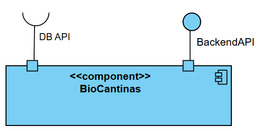
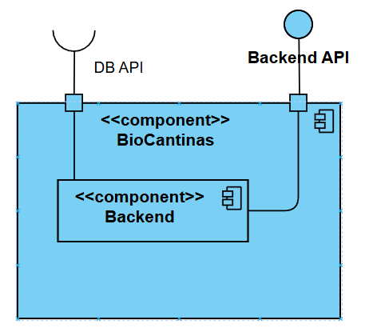
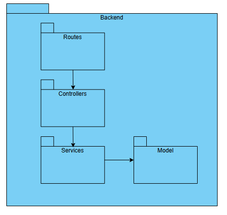
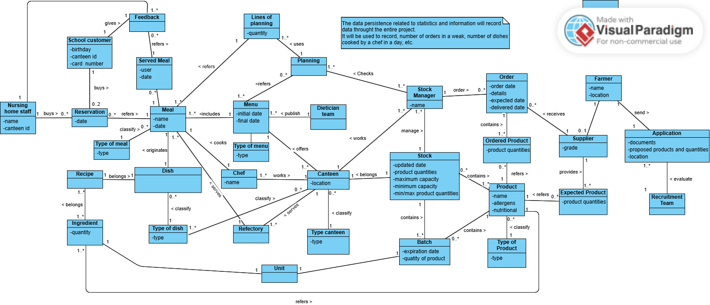

[Voltar ao README](../README.md)

[Próximo ficheiro](f_nf_requirements.md)

---
## System Overview

**BioCantinas** is a web information system designed for the sustainable management of
school canteens and nursing homes in the municipality of Cinfães. The system supports
menu planning processes, supplier and stock management, sanitary control, and meal
reservations, promoting the use of organic and locally produced products.

### Purpose of the system

To digitalize and automate the operational flows of canteens in the BioCantinas network,
ensuring product traceability, waste control, sanitary safety, and nutritional
transparency for end users.

### Architecture Overview

The system architecture is documented using a C4 models, providing increasing levels of detail regarding the system’s organization and internal structure.

#### Level 1 – System Context

The Level 1 diagram presents a high-level view of the BioCantinas system as a single logical entity. At this level, the system is shown as responsible for exposing a backend API that supports all application functionalities.

The system interacts with a database for persistent data storage and retrieval. All core operations, including menu management, reservations, supplier management, and KPI calculation, are handled internally and exposed through the backend API.

#### Level 2

The Level 2 diagram refines the architecture by detailing the main internal container responsible for business logic execution: the backend.

At this level, the backend is represented as the core component that:

- Exposes RESTful API endpoints
- Processes incoming requests
- Coordinates business logic execution
- Interacts with the database for data persistence

The API acts as the single entry point to the system, enforcing validation, access control, and orchestration of operations across different functional domains such as reservations, menus, stock, and suppliers.

#### Level 3
The Level 3 diagram provides a detailed view of the internal structure of the backend, following a layered and modular design aligned with best practices for maintainability and separation of concerns.

The backend is organized into the following main components:

- Routes - Define the available API endpoints and map HTTP requests to the appropriate controllers.
- Controllers - Handle incoming requests, perform input validation, and delegate processing to the service layer.
- Services - Implement the core business logic, enforce domain rules, and coordinate interactions between components.
- Models - Represent the domain entities and handle data persistence through the ORM layer.

The flow of execution follows a clear and consistent pattern:
Routes → Controllers → Services → Models

This structure ensures that responsibilities are well-defined, promotes reusability, and simplifies testing and maintenance. It also enforces a clean separation between presentation logic, business logic, and data access.

### Main users and profiles

| Profile                          | Main responsibilities                                                                                                      |
|----------------------------------|----------------------------------------------------------------------------------------------------------------------------|
| Network Admin                    | Global network management, application approval, supplier quarantine, sanitary closure of parishes, network KPIs           |
| Canteen Manager                  | Canteen management, quarantine activation, canteen KPI visualisation                                                       |
| Refectory Manager                | Refectory management, refectory KPI visualisation                                                                          |
| Dietician Team                   | Menu publication, nutritional and allergen validation                                                                      |
| Stock Manager                    | Stock management, supplier orders, shortage notifications                                                                  |
| Supplier                         | Viewing and responding to orders, management of available products                                                         |
| Customer (School / Nursing Home) | Menu consultation, meal reservation, feedback                                                                              |

### Main business operations

- Supplier application and onboarding (with validated parish selection)
- Publication and approval of weekly menus with nutritional information
- Quantity planning and automatic order generation
- Meal reservation and consumption by customers
- Supplier quarantine and sanitary closure of parishes
- Calculation and visualization of KPIs (waste, organic percentage,
  performance by canteen/refectory/network)

### Main solution components

The system follows a **Layered Architecture**:

- **REST API** — Node.js + Express, exposed via HTTP for consumption by the frontend
- **Backend (internal layers)**
  - *Frameworks/Drivers Layer* — HTTP routing, Express configuration, MySQL driver
  - *Adapters Layer* — controllers: input validation, delegation to services
  - *Application Layer* — services: business logic, repository coordination
  - *Domain Model Layer* — core entities and business rules
- **Database** — MySQL, accessed via Sequelize ORM
- **File storage** — PDF documents submitted by suppliers during application;
  reports and KPI exports generated on the server

### Data handled by the application

- Users, credentials and access profiles (role-based)
- Suppliers, products, location (municipality, parish, zone)
- Menus, meals, dishes, recipes, ingredients and nutritional information
- Reservations, served meals and feedback
- Stock, batches, orders and ordered products
- Production plannings and planning lines
- KPIs for waste, organic percentage and operational performance
- Supplier documentation (PDF files)
- Quarantine and sanitary parish closure records

### Interactions between API, database and file storage

The frontend communicates exclusively with the REST API via HTTP. The API accesses the
database through the Sequelize ORM and the server file system for upload, read and
document organization operations. There is no direct access from the frontend to the
database or file system.

### Planned use of server operating system features

- **File and directory management**: organization of supplier documents and reports
  in directories structured by canteen and academic year
- **File upload and reading**: receipt of PDFs submitted by suppliers during the
  application process
- **File generation**: export of KPI reports in PDF or CSV format at the request
  of managers
- **Task scheduling (cron/scheduler)**: automatic weekly generation of production
  plannings and supplier orders based on published menus and available stock

---

## Domain Model

The BioCantinas domain model is organized into six core **aggregates**, reflecting the
main functional contexts of the system. Roles are defined transversally and condition
access flows and sensitive operations.

#### Menu & Meal
Covers the definition, planning and classification of meals and menus.

- **Entities**: Menu, Meal, Dish, Recipe, Ingredient, Chef, Dietician Team, Canteen,
  Refectory
- **Invariant**: a menu may only be published after nutritional validation by the
  Dietician Team
- **Sensitive operations**: menu publication, nutritional information approval,
  allergen management

#### Reservation
Covers customer interaction with the system.

- **Entities**: Customer (School Customer, Nursing Home Staff), Reservation, Served
  Meal, Feedback
- **Invariant**: a reservation may only be created if a published menu exists for the
  selected date and refectory
- **Sensitive operations**: meal reservation, consumption registration, feedback
  submission

#### Supplier
Covers supplier recruitment, onboarding and sanitary control.

- **Entities**: Farmer, Application, Supplier, Expected Product, Recruitment Team
- **Invariant**: location selection (parish) is mandatory and validated against the
  official list; only farmers with an approved application transition to Supplier
- **Sensitive operations**: application submission (with PDF document upload),
  approval/rejection by the Recruitment Team, quarantine activation, sanitary
  closure of parish
- **Associated files**: PDF documents submitted during the application, organized in
  per-supplier directories on the server

#### Stock & Order
Covers inventory control and the order cycle.

- **Entities**: Stock Manager, Stock, Product, Batch, Order, Ordered Product
- **Invariant**: orders may not include products from suppliers under quarantine
  or from parishes with an active sanitary closure
- **Sensitive operations**: order creation, delivery confirmation, batch management,
  stock shortage notification

#### Planning
Covers quantity forecasting and dynamic order adjustment.

- **Entities**: Planning, Lines of Planning
- **Invariant**: planning verifies stock availability before generating orders;
  quantities are adjusted after each confirmed reservation
- **Sensitive operations**: automatic weekly planning generation (scheduled server
  operation), quantity adjustment by reservations

#### KPI & Statistics
Covers operational monitoring and decision support.

- **Entities**: Waste KPI, Organic percentage KPI, Performance KPI by
  canteen/refectory/network
- **Invariant**: access to KPIs is restricted by role — Canteen Manager sees their
  own canteen, Refectory Manager sees their own refectory, Network Admin sees the
  full network with filters by canteen, refectory and producer
- **Sensitive operations**: report export (file generation on the server),
  organic percentage calculation by weight

### Roles and flow conditioning

| Role              | Accessible aggregates                | Restrictions                          |
|-------------------|--------------------------------------|---------------------------------------|
| Network Admin     | All                                  | No scope restriction                  |
| Canteen Manager   | Menu, Stock, Planning, KPI (canteen) | Scope limited to their canteen        |
| Refectory Manager | Reservation, KPI (refectory)         | Scope limited to their refectory      |
| Dietician Team    | Menu & Meal                          | Publication and validation only       |
| Stock Manager     | Stock & Order                        | Stock and order management            |
| Supplier          | Order (read), Product                | Their own products and orders only    |
| Customer          | Reservation                          | Their own reservations only           |

### Elements linked to files and server operations

| Element                              | Operation                             | Location                       |
|--------------------------------------|---------------------------------------|--------------------------------|
| Application documents (Supplier)     | PDF upload on registration            | `/uploads/suppliers/{id}/`     |
| KPI reports                          | Generation and download               | `/reports/{canteen}/{season}/` |
| Weekly planning                      | Scheduled generation (cron)           | Persistence in database        |
| Order export                         | File generation for supplier          | `/exports/orders/`             |

---

[Voltar ao README](../README.md)

[Próximo ficheiro](f_nf_requirements.md)