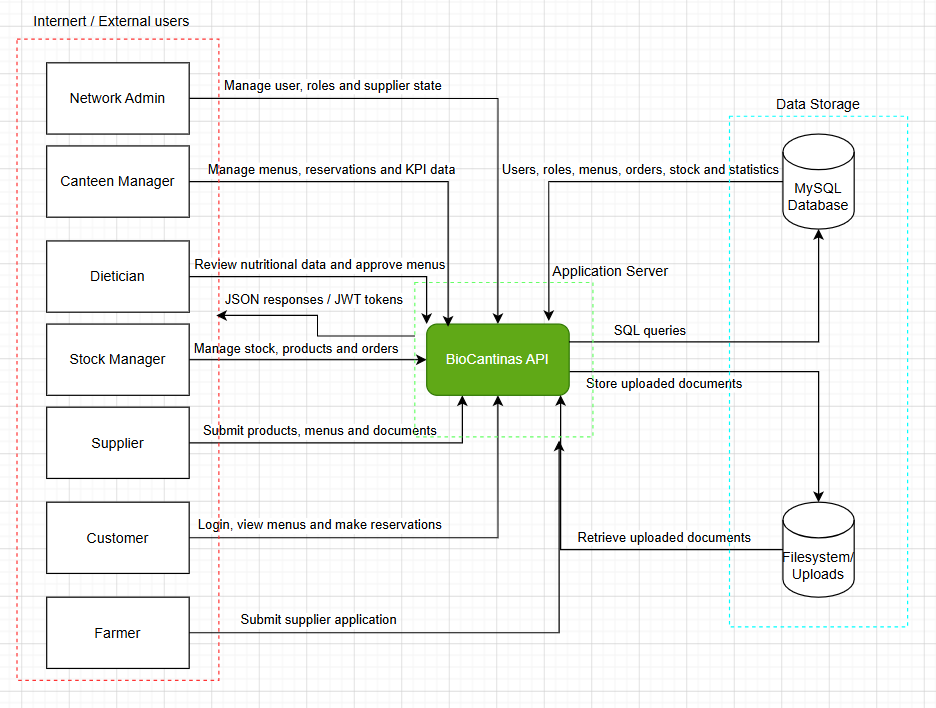
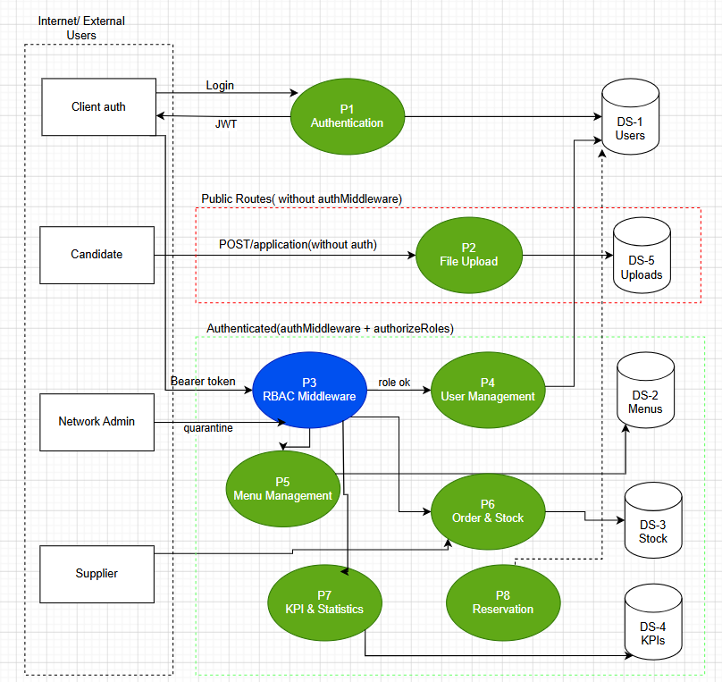
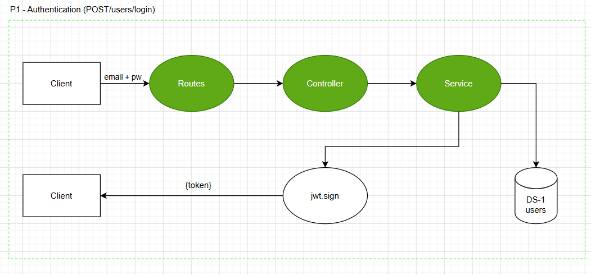
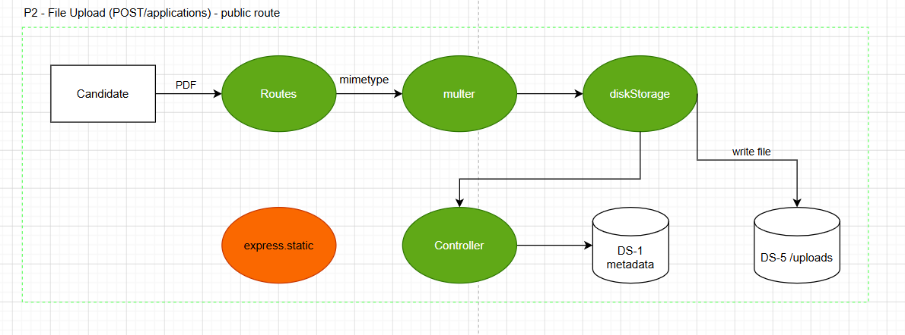

[Voltar ao README](../README.md)

[Próximo ficheiro](stride.md)

[Ficheiro anterior](security_requirements.md)

---
## Threat Modeling

Threat modeling was performed to identify potential security risks in the system before defining concrete security requirements and countermeasures. This analysis focuses on understanding how the system is structured, where users and external actors interact with it, which assets need protection, and where trust boundaries exist.

The process starts with an information gathering phase, followed by the creation of Data Flow Diagrams (DFDs) and the application of the STRIDE methodology to classify and analyse threats.

### Information Gathering

| Field            | Description                                                                                                                                                                                                                                                       |
|------------------|-------------------------------------------------------------------------------------------------------------------------------------------------------------------------------------------------------------------------------------------------------------------|
| **Entry points** | POST `/users/login` authentication POST `/applications` file upload — public All REST API routes under `/api/*` authenticated                                                                                                                               |
| **Exit points**  | HTTP JSON responses GET `/uploads/*` static file serving `console.log` output to stdout Application log files                                                                                                                                            |
| **Assets**       | User credentials and JWT tokens Personal data names, emails  Supplier confidential documents PDFs Menus, meals, recipes and nutritional data KPIs, waste reports and performance statistics Server filesystem `upload` directory MySQL database |
| **Trust levels** | Level 0 — Unauthenticated/public registration/login Level 1 — Authenticated Customer/Supplier Level 2 — Canteen/Refectory Manager Level 3 — Dietician/Stock Manager Level 4 — Network Admin/full trust                                                |---

### Data Flow Diagrams

The following Data Flow Diagrams were created to support the threat modeling process. They show how external actors interact with the BioCantinas system, how data moves between processes, and where the main trust boundaries and data stores are located.

#### Data Flow Diagram - Level 0

The Level 0 DFD provides a high-level overview of the system. It represents the BioCantinas API as the central application component and shows the main external actors, such as Network Admin, Canteen Manager, Dietician, Stock Manager, Supplier, Customer and Farmer. These actors send requests to the API to perform actions such as logging in, managing menus, submitting products, managing stock, making reservations and submitting supplier applications. The diagram also shows the two main data stores used by the system: the MySQL database, where structured application data is stored, and the filesystem `/uploads`, where uploaded documents are saved.

#### Data Flow Diagram - Level 1

The Level 1 DFD decomposes the application into its main internal processes. Authentication is represented separately as the process responsible for validating login credentials and issuing JWT tokens. Public routes, such as supplier applications and file uploads, are separated from authenticated routes. The authenticated area includes the RBAC middleware, which checks the user role before allowing access to protected processes such as user management, menu management, order and stock management, reservations, and KPI/statistics. This diagram helps identify where authorization checks are required and which data stores each process interacts with.

#### Data Flow Diagram - Level 2 - Process 1: Authentication

This Level 2 DFD details the authentication process for `POST /users/login`. The client sends an email and password to the route, which forwards the request to the controller and then to the service layer. The service checks the user information against the users data store. If the credentials are valid, the system signs a JWT token and returns it to the client. This diagram is important for identifying threats related to spoofing, credential attacks, weak JWT handling, token replay and information disclosure during login.

#### Data Flow Diagram - Level 2 - Process 2: File Upload

This Level 2 DFD details the public file upload process used by `POST /applications`. A candidate submits a PDF file through the route, which is processed by `multer` and stored using `diskStorage`. The uploaded file is written to the filesystem `/uploads`, while its metadata is stored in the database. The diagram also shows that uploaded files may later be retrieved through `express.static`. This makes the upload pipeline a relevant security area, since it introduces risks such as malicious file uploads, unrestricted file access, path traversal, exposure of confidential documents and missing authentication around static file serving.

## Trust Boundaries

A Trust Boundary is a logical or physical boundary that separates two contexts with different trust levels. Any data crossing such a boundary must be validated, authenticated, or authorized. It cannot be assumed to come from a trustworthy source.

In the DFD's above, the Trust Boundaries are represented by the dashed lines that divides each diagram, everything on the left side is in a lower trust zone (external/public), everything to the right is inside the application's controlled perimeter.

The following Trust Boundaries were identified in this system:

| ID       | Trust Boundary                           | Separation                                                                                                                                                                                      | DFD Element                                        |
|----------|------------------------------------------|-------------------------------------------------------------------------------------------------------------------------------------------------------------------------------------------------|----------------------------------------------------|
| **TB-1** | Internet → Express API                   | Separates unauthenticated external actors (Level 0) from the application entry point. All inbound traffic must be treated as untrusted.                                                         | External Entity (Candidate / User) → Routes        |
| **TB-2** | Authenticated user → Protected resources | Separates a valid JWT (Level 1–3) from operations that require role-based authorization. Being authenticated does not imply being authorized.                                                   | RBAC Middleware → Business processes (P3–P7)       |
| **TB-3** | Application → MySQL database             | Separates business logic from the data store. No query should reach the database without going through the ORM (Sequelize) layer.                                                               | Controllers → DS-1 MySQL                           |
| **TB-4** | Application → Filesystem (`/uploads`)    | Separates the controlled upload pipeline (`multer → diskStorage`) from the file data store. Files written here are potentially reachable via `express.static` without any authentication check. | `diskStorage` / `express.static` → DS-5 `/uploads` |

---
[Voltar ao README](../README.md)

[Próximo ficheiro](stride.md)

[Ficheiro anterior](security_requirements.md)