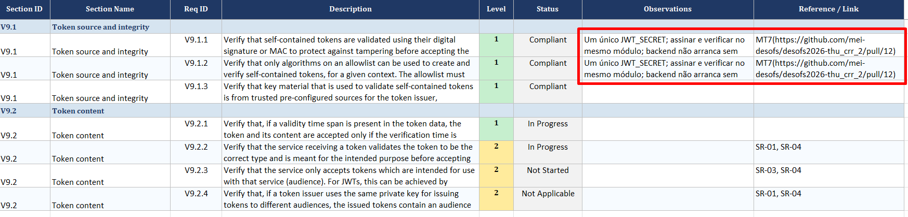

[Back to README](../README.md)

[Next file](automation.md)

[Previous file](Mitigations_Fixed.md)

---

## ASVS - Phase 2 traceability

The OWASP Application Security Verification Standard checklist remains the reference for **what** must be verified. In Phase 1, requirements were mapped to Security Requirements ([security_requirements.md](../Phase_1/security_requirements.md)) (`SR-xx`) and tracked in the spreadsheet.

In **Phase 2**, we extend that traceability by linking each **implemented mitigation** (`MTxx`) to:

1. The **risk** it addresses (`R1`–`R9` from [risk_assessment.md](../Phase_1/risk_assessment.md));
2. The **ASVS requirement IDs** (`Vxx.x.x`) it supports;
3. The **GitHub pull request** that introduced the change (evidence of implementation);
4. The technical write-up in [Mitigations_Fixed.md](Mitigations_Fixed.md) in observations.

Levels **1 and 2** still apply, as in Phase 1.

### Traceability chain

```text
Risk (R#) → Mitigation (MT#) → ASVS (V#.#.#) → Pull Request (URL) → Mitigations_Fixed.md
```
Evidence excel example:


