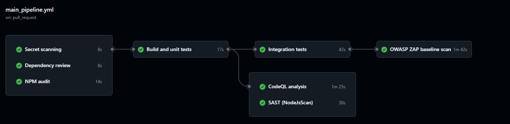

[Voltar ao README](../README.md)

---
# Main Pipeline Documentation – GitHub Actions

## Objective

The main pipeline was developed to automate the Continuous Integration (CI) and security processes of the project. This pipeline ensures that every change submitted through a *Pull Request* to the `main` branch is automatically validated before being merged.

The pipeline includes security checks, dependency analysis, vulnerability auditing, test execution, static code analysis, and dynamic application testing.

---

# General Pipeline Structure

The pipeline is defined in the following file:

```text
.github/workflows/main_pipeline.yml
```

The pipeline is automatically triggered whenever a *Pull Request* targeting the `main` branch is created or updated.

```yaml
on:
  pull_request:
    branches: [ main ]
```

---

# Permissions

Minimal permissions were configured to improve security during pipeline execution.

```yaml
permissions:
  contents: read
  pull-requests: read
  security-events: write
```

These permissions allow the pipeline to:

- Read repository contents;
- Read Pull Request information;
- Upload security results to the GitHub Security tab.

---

# Pipeline Jobs

The pipeline is organized into multiple jobs, each responsible for a specific task.

---

## 1. Secret Scanning

### Objective

Detect exposed secrets in the repository, such as:

- API keys
- Passwords
- Tokens
- Credentials

### Tool Used

- Gitleaks

### How It Works

The job checks out the repository and runs Gitleaks to scan the project history.

```yaml
uses: gitleaks/gitleaks-action@v2
```

### Benefits

- Prevents credential leaks;
- Improves repository security;
- Detects secrets before merge.

---

## 2. Dependency Review

### Objective

Analyze dependency changes introduced in the Pull Request.

### Tool Used

- GitHub Dependency Review Action

### How It Works

The job checks whether vulnerable or insecure dependencies were introduced.

```yaml
uses: actions/dependency-review-action@v4
```

The pipeline is configured to fail if high severity vulnerabilities are detected.

```yaml
fail-on-severity: high
```

### Benefits

- Prevents vulnerable libraries from being added;
- Protects the dependency chain;
- Identifies security risks early.

---

## 3. NPM Audit

### Objective

Run a security audit on Node.js dependencies.

### Tool Used

- npm audit

### How It Works

The job:

1. Installs dependencies;
2. Runs vulnerability auditing;
3. Generates JSON reports.

```yaml
npm audit --audit-level=high
```

The pipeline fails if high or critical vulnerabilities are found.

### Benefits

- Automatic vulnerability detection;
- Continuous dependency verification;
- Improved backend security.

---

## 4. Build and Unit Tests

### Objective

Ensure that the project builds correctly and all unit tests pass.

### Features

- TypeScript compilation;
- Unit test execution;
- Test coverage generation.

### How It Works

This job only executes after successful completion of the previous jobs:

```yaml
needs: [secret-scanning, dependency-review, npm-audit]
```

The following commands are executed:

```yaml
npm run build
npm run test:unit -- --coverage
```

### Reports

Test coverage is uploaded as an artifact:

```yaml
uses: actions/upload-artifact@v4
```

### Benefits

- Automatic code validation;
- Ensures functionality correctness;
- Monitors test coverage.

---

## 5. CodeQL Analysis

### Objective

Perform advanced static code analysis to identify vulnerabilities.

### Tool Used

- GitHub CodeQL

### How It Works

CodeQL analyzes JavaScript/TypeScript code searching for:

- Security vulnerabilities;
- Bad practices;
- Potentially exploitable flaws.

```yaml
uses: github/codeql-action/init@v4
```

The following configuration was used:

```yaml
queries: security-extended
```

### Benefits

- Advanced static analysis;
- GitHub Security integration;
- Automatic vulnerability detection.

---

## 6. SAST – NodeJsScan

### Objective

Perform SAST (*Static Application Security Testing*) on the backend.

### Tool Used

- NodeJsScan

### How It Works

NodeJsScan analyzes the application source code:

```yaml
uses: ajinabraham/njsscan-action@master
```

A SARIF report is generated.

### Upload to GitHub Security

The results are automatically uploaded to the GitHub Security tab.

```yaml
uses: github/codeql-action/upload-sarif@v4
```

### Benefits

- Detects common vulnerabilities;
- Automated security analysis;
- GitHub security integration.

---

## 7. Integration Tests

### Objective

Execute backend integration tests.

### Services Used

A MySQL container is automatically created:

```yaml
services:
  mysql:
    image: mysql:8.4
```

### How It Works

The job:

1. Starts the database;
2. Installs dependencies;
3. Runs integration tests.

```yaml
npm run test:integration
```

### Benefits

- Tests component integration;
- Validates database connectivity;
- Ensures functionality in a realistic environment.

---

## 8. DAST – OWASP ZAP Baseline Scan

### Objective

Perform DAST (*Dynamic Application Security Testing*) against the running application.

### Tool Used

- OWASP ZAP

### How It Works

The job:

1. Starts the backend application;
2. Waits for the server to become available;
3. Executes an automated scan against the endpoint.

```yaml
uses: zaproxy/action-baseline@v0.14.0
```

The scan targets:

```text
http://localhost:3000
```

### Generated Reports

The following reports are generated:

- HTML
- Markdown
- JSON

The reports are uploaded as artifacts.

### Benefits

- Runtime vulnerability detection;
- Identification of insecure headers;
- Automated web security testing.

---

# Job Dependencies

The pipeline was organized sequentially to ensure that only secure and functional code progresses to later stages.

## Pipeline Flow


---

# Technologies Used

| Technology | Purpose |
|---|---|
| GitHub Actions | CI/CD automation |
| Node.js 20 | Runtime environment |
| Gitleaks | Secret detection |
| npm audit | Dependency auditing |
| CodeQL | Advanced static analysis |
| NodeJsScan | SAST |
| MySQL 8.4 | Database for testing |
| OWASP ZAP | DAST |

---
---
[Voltar ao README](../README.md)