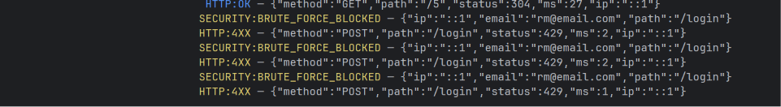
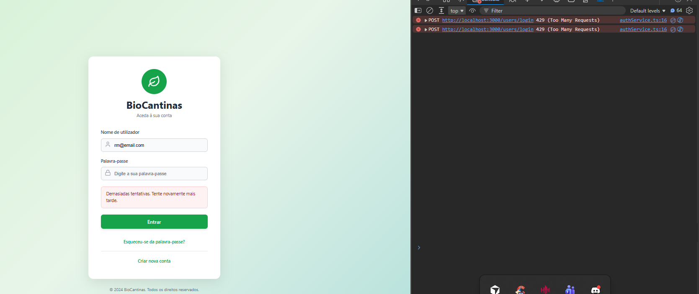

[Voltar ao README](../README.md)

---

# Logging, Security & Auto Deploy

## 1. Logging Architecture

The logging system was implemented using **Winston** and distributed across several specialized middlewares, each with a single responsibility.

```
index.ts
 ├── express.json()           ← body parsing
 ├── httpLogger               ← all HTTP requests
 ├── securityLogger           ← XSS / SQLi / Path Traversal detection
 ├── [routes]
 │    └── /users/login
 │         ├── loginRateLimiter   ← rate limiting + brute-force logging
 │         └── loginLogger        ← authentication success/failure
 ├── authorizeRoles           ← authorization failures
 └── errorHandler             ← unhandled errors (last middleware)
```

---

## 2. Implemented Files

### `src/utils/logger.ts` - Central Logger (Winston)

Singleton logger shared across all middlewares.

**Behavior per environment:**

| Environment | Minimum level | Colors | Stack traces |
|---|---|---|---|
| `development` | `debug` | ✅ | ✅ |
| `production` | `info` | ❌ | ✅ (server logs only, never sent to client) |

**Log line format:**
```
[2026-06-06T12:00:00.000Z] WARN  SECURITY:XSS_ATTEMPT - {"ip":"1.2.3.4","method":"POST","path":"/users/login","payload":"<script>"}
```

- Timestamp in **UTC** (ISO 8601)
- Level in uppercase, padded to 5 characters
- Structured metadata as inline JSON
- Output exclusively to **stdout** → automatically captured by Render

---

### `src/middlewares/httpLogger.ts` - HTTP Request Logging

Logs **every** incoming request with: method, path, HTTP status, duration (ms), and real client IP.

Respects the `X-Forwarded-For` header to extract the correct IP behind Render's proxy.

**Classification by status:**

| Status | Level | Event |
|---|---|---|
| 2xx | `debug` | `HTTP:OK` |
| 4xx | `warn` | `HTTP:4XX` |
| 5xx | `error` | `HTTP:5XX` |

**Example:**
```
[2026-06-06T14:23:01.000Z] WARN  HTTP:4XX - {"method":"POST","path":"/users/login","status":401,"ms":12,"ip":"85.240.1.1"}
```

---

### `src/middlewares/securityLogger.ts` - Attack Detection

Middleware that inspects query params and request body for attack patterns on every request. It is passive (detection only - does not block requests) and intended for auditing.

**Detected patterns:**

| Type | Pattern examples |
|---|---|
| **XSS** | `<script`, `javascript:`, `onclick=`, `<iframe`, `vbscript:` |
| **SQL Injection** | `OR 1=1`, `UNION SELECT`, `DROP TABLE`, SQL comments |
| **Path Traversal** | `../`, `..\` |

All detected values are sanitized (CR/LF stripped, truncated to 500 chars) before being logged, to prevent log injection.

**Example log:**
```
[2026-06-06T14:23:05.000Z] WARN  SECURITY:SQLI_ATTEMPT - {"ip":"85.240.1.1","method":"GET","path":"/products","ua":"curl/7.88","payload":"' OR 1=1--"}
```

**Also in `securityLogger.ts`:**

- **`loginLogger`** - intercepts `res.json` to log the login outcome after the response is formed:
  - `AUTH:LOGIN_SUCCESS` with IP and email (sanitized)
  - `AUTH:LOGIN_FAILED` with IP, email, and reason
- **`onRateLimitHit`** - called by `loginRateLimiter` when an IP exceeds 10 attempts in 15 min:
  - Logs `SECURITY:BRUTE_FORCE_BLOCKED` and responds with 429

---

### `src/middlewares/authorizeRoles.ts` - Authorization Logging

Logs access control failures on all protected routes.

| Situation | Event | Level |
|---|---|---|
| No JWT token | `SECURITY:UNAUTHENTICATED_ACCESS` | `warn` |
| Insufficient role | `SECURITY:ACCESS_DENIED` | `warn` |

Includes: `userId`, user `role`, `requiredRoles`, method, path, and IP.

---

### `src/middlewares/errorHandler.ts` - Central Error Handler

Registered as the **last middleware** in `index.ts`. Catches all unhandled exceptions.

- Logs the full error with stack trace via Winston (`UNHANDLED_ERROR`)
- Returns a generic message to the client in production (`"Internal server error"`)
- In development, exposes `err.message` to aid debugging

---

### `src/utils/safeDebugLog.ts` - Log Data Protection

Ensures `req.body` is **never logged in production**. In development, only key names (not values), params, and method are recorded.

Covers ASVS V16.2.5 - credentials, tokens, and personal data are never exposed in logs.

---

### `src/middlewares/authMiddleware.ts` - Rate Limiting

| Limiter | Window | Max requests | Action on exceed |
|---|---|---|---|
| `apiRateLimiter` | 15 min | 1000 req/IP | Standard 429 |
| `loginRateLimiter` | 15 min | 10 req/IP | 429 + `SECURITY:BRUTE_FORCE_BLOCKED` log |

---

## 3. Security Events Logged

Complete reference of all events logged by the system:

| Event | Middleware | Level | When |
|---|---|---|---|
| `HTTP:OK` | httpLogger | debug | 2xx response |
| `HTTP:4XX` | httpLogger | warn | 4xx response |
| `HTTP:5XX` | httpLogger | error | 5xx response |
| `AUTH:LOGIN_SUCCESS` | loginLogger | info | Successful login |
| `AUTH:LOGIN_FAILED` | loginLogger | warn | Failed login |
| `SECURITY:BRUTE_FORCE_BLOCKED` | onRateLimitHit | warn | Login rate limit exceeded |
| `SECURITY:XSS_ATTEMPT` | securityLogger | warn | XSS pattern detected |
| `SECURITY:SQLI_ATTEMPT` | securityLogger | warn | SQL injection pattern detected |
| `SECURITY:PATH_TRAVERSAL` | securityLogger | warn | Path traversal pattern detected |
| `SECURITY:UNAUTHENTICATED_ACCESS` | authorizeRoles | warn | Request without JWT token |
| `SECURITY:ACCESS_DENIED` | authorizeRoles | warn | Insufficient role |
| `UNHANDLED_ERROR` | errorHandler | error | Unhandled exception |
| `DB:CONNECTED` | index.ts | info | Database connection established |
| `SERVER:START` | index.ts | info | Server started |
| `SERVER:BOOT_FAILED` | index.ts | error | Boot failure |

---

## 4. Production Logging - Render Integration

### How it works

Render automatically captures everything written to **stdout** and **stderr**. Winston is configured with a single `Console` transport, meaning all logs reach Render with no additional configuration.

```
App (Winston → stdout)  →  Render Log Stream  →  Dashboard / Export
```

### Environment variables configured on Render

| Variable | Value | Effect |
|---|---|---|
| `NODE_ENV` | `production` | Disables debug logs, client-side stack traces, and body logging |
| `LOG_LEVEL` | *(omitted or `info`)* | Minimum log level |
| `JWT_SECRET` | *(secret)* | Never exposed in source code or logs |
| `DATABASE_URL` / DB credentials | *(secrets)* | Managed exclusively via Render Environment Variables |

> No sensitive variable is present in source code or build artifacts. The local `.env` file is listed in `.gitignore`.

### Accessing logs

Logs are available in real time in the Render dashboard under **Logs > Live**. Render retains a log history configurable per plan.

---

## 5. Auto Deploy - Render Pipeline

### Deploy flow

```
git push → GitHub → Render (webhook) → Build → Deploy → Production
```

After every commit to the main branch (`main`), Render detects the change via a GitHub webhook, runs the build, and deploys automatically with no manual intervention.

### Pipeline steps

1. **Trigger** - push to `main` fires the Render webhook
2. **Build** - `npm install && npm run build` (TypeScript transpilation)
3. **Start** - `node dist/index.js` with Render-injected environment variables
4. **Health check** - Render verifies the service is responding before routing traffic
5. **Zero-downtime** - the previous instance stays live until the new one is ready

### Pipeline security

- Secrets and environment variables are injected by Render at runtime and never pass through the repository
- `.gitignore` excludes `.env`, `node_modules`, and `dist/`
- Production code contains no exposed test data bootstrap logic

## Login Example





---
[Voltar ao README](../README.md)
