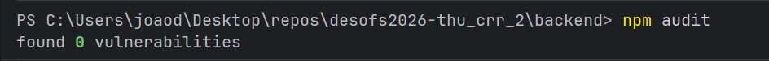
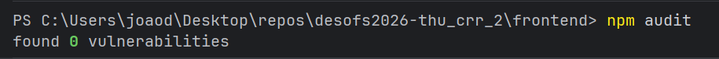

[Voltar ao README](../README.md)

---

# Vulnerability Management (SCA)

Revisão de dependências do **Backend** e **Frontend** com `npm audit`. Todas as vulnerabilidades identificadas foram corrigidas — **0 vulnerabilidades** em ambos os componentes.

---

## Resultado

| Componente | Estado |
| :--- | :--- |
| Backend | `npm audit` → **0 vulnerabilities** |
| Frontend | `npm audit` → **0 vulnerabilities** |

### Evidência

**Backend**



**Frontend**



---

## Ações realizadas

| Componente | Correção |
| :--- | :--- |
| Backend | Override `uuid@^11.1.1` em `package.json` (transitiva via `sequelize`) |
| Frontend | `npm audit fix` + upgrade `vite@8`, `@vitejs/plugin-react@6`, override `esbuild@^0.28.1` |

**Riscos aceites:** nenhum.

---

## Ferramentas

- `npm audit` — análise SCA (local + CI no Backend)
- Dependency Review — bloqueia PRs com dependências **high**+
- CodeQL — análise estática complementar

---

## Verificação

```bash
cd Backend && npm audit
cd Frontend && npm audit
```

**Rastreabilidade:** ASVS V14.2 · OWASP A06 (Vulnerable and Outdated Components)

---

[Voltar ao README](../README.md)
